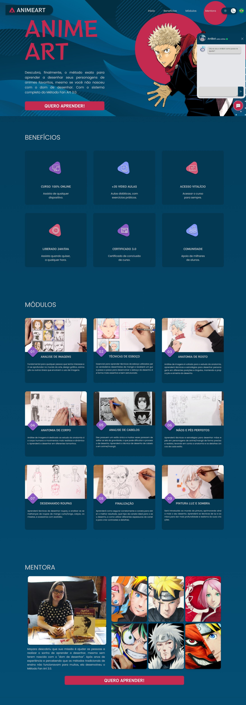

<h1 align="center">Landing Page Animeart!! 🖍️</h1>
 

Technology event organized by Le Wagon School, in partnership with the Lisbon City Council through the Future of Work Lisboa program.
                  During the event, the challenge was to create a landing page on the subject we wanted (personal, real or fictitious products, etc.), 
                  so here's the page I made for the challenge.
                  https://lubernardino.github.io/Landing-Page-Animeart/

 
 
 ## 🚀 Tecnologias.

This project was developed with the following technologies:

- HTML e CSS.
- Git e Github.
- Figma.
  
 
## 🎨 Landing page Anime Art.

  

